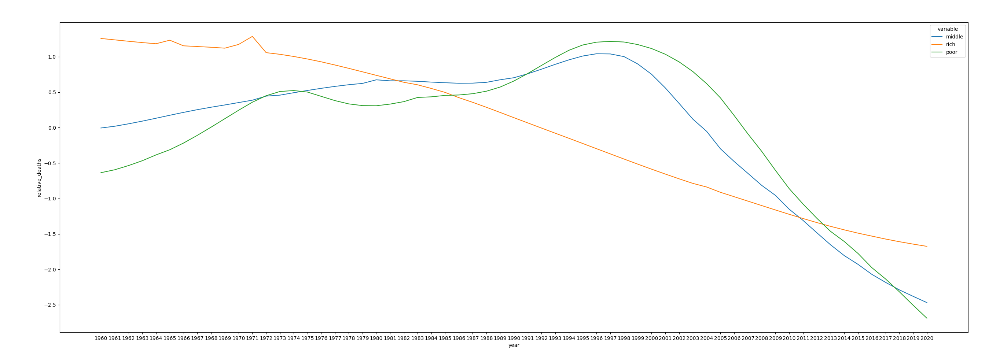
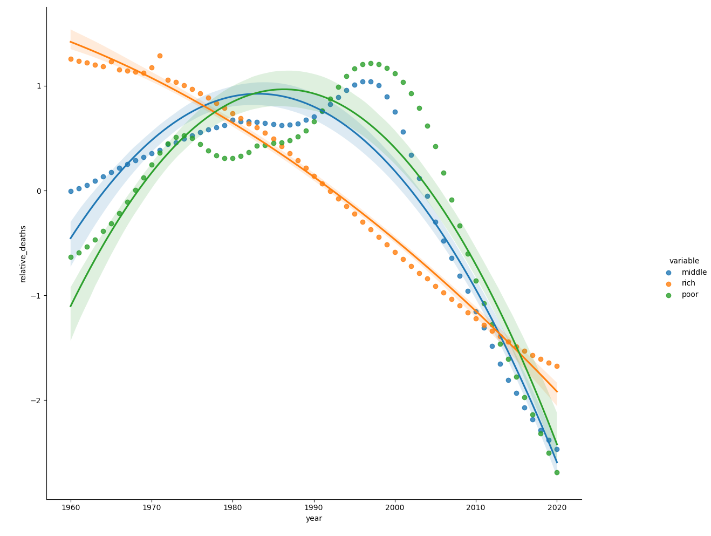

# infant_deaths_by_nation_wealth

This is a quick (largely visual; though some regression used) analysis of the relative deaths under five for countries which I designate 3 categories for:
(1) rich (2) middle-class (3) poor, which aim to see the trends of how deaths under 5 has changed.

The ultimate conclusion recieved from this analysis was that middle class and poor countries have had a steeper delcine than rich countries (largely following the same trajectory) in their deaths under five, though this decline only began to occur in the 1990's (this is liklely affected by low infrastructure to record all deaths in the middle class and poor countries; e.g. middle class having higher relative deaths to start off with because higher development to count more deaths). It is very interesting to see that middle class and poor countries have had a very similar trajectory in relative deaths under 5 even though there are worlds of differences between the gdp per capita in those two groups of nations





#### Data
```python
#from https://data.worldbank.org/indicator/SH.DTH.MORT
#this data has a list of deaths under the age of 5 for all countries by year starting in 1960 (although some have no or sparse data)
deaths = pd.read_csv("./deaths_under_5_global.csv")

#from https://www.worldometers.info/gdp/gdp-by-country/
#this data ranks countries by their GDP
rankings = pd.read_excel("./gdp_rankings.xlsx")
```